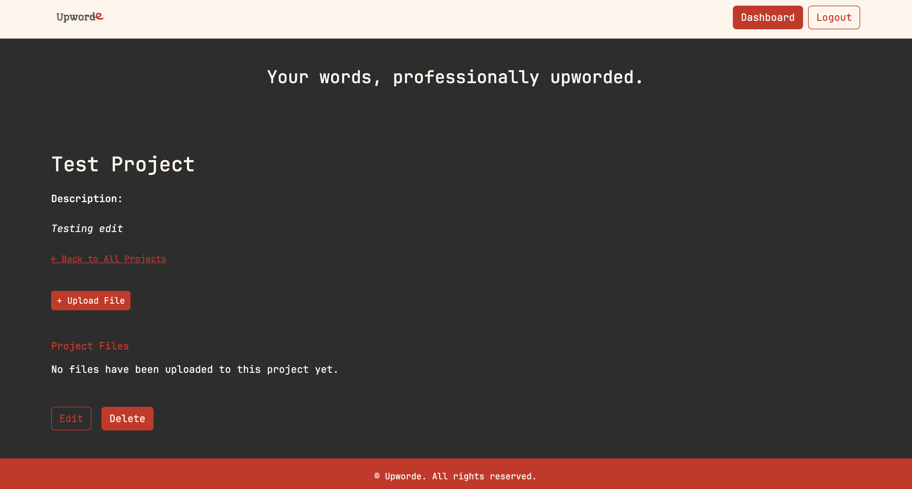
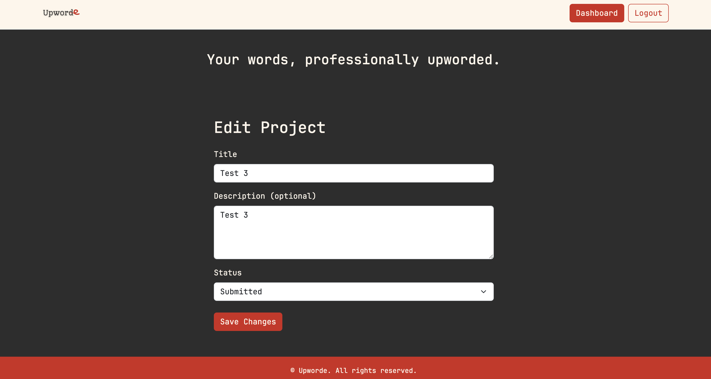

# Upworde
This is a custom web application for an editing subscription service that will manage the entire customer journey.

## Project Overview
Upworde is a custom solution for an editorial service provider who wants to offer proofreading
and editing subscriptions effortlessly to their clientele. I started this project as an
extension of my freelance editing business to provide something different for authors
on a limited budget.

The following technologies were used during the development of this project:

* PhpStorm
* PHP
* Laravel
* HTML
* CSS
* JavaScript
* Bootstrap
* SQL
* MySQL
* Git / GitHub

## Development
Development for this project began on April 12, 2025, and is ongoing.

I created this website/application as a solution to needing to use multiple platforms to accomplish one goal 
of operating an editing subscription business.

My primary goal for this project is to create a robust system that allows easy communication between editor and client 
throughout the process of editing short- and long-form documents/manuscripts. 

## Color Scheme
```
:root {
--dark: #2D2D2D;
--light: #FDF6EC;
--contrast: #C0392B;
}
```

## Solution Design
This solution will address the problem of needing to use multiple platforms to operate one business. With that
design in mind, the following implementations will be included:

* User roles: admin, client, and editor
* Free user capability for potential clients to request a free sample edit
* An admin panel for the managing editor to assign projects to other editors
* Ability for all roles to download/upload files and assign to a client's project
* Status update feed that notifies clients of progress on their projects
* Payment processing for members
* Knowledgebase for problem-solving writing issues

## Future Plans
The final form for this app will be a freelance platform for editorial professionals once I have proof of concept.

## Screenshots
### Home Page

### Dashboard

### Project Page

### Edit Project
